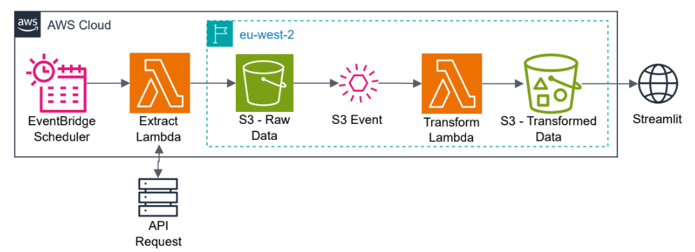
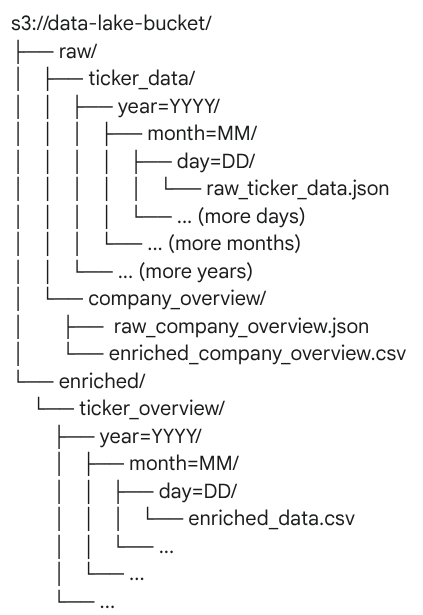

# Quant Stock Dashboard

This project showcases a Streamlit web application designed to provide an interactive exploration of financial stock data, with a focus on quantitative analysis and visual insights for a few selected stocks using the [Alpha Vantage API](https://www.alphavantage.co/).

Beyond the user-facing application, the core strength of this project lies in its automated data pipeline built entirely on AWS serverless services.

To access the app press [this link](https://quant-dahsboard-frgmonxbbizzp6pswsy8uz.streamlit.app/).

##  Overview

This application focuses on extracting and analyzing stock and company overview data for 4 companies - Argenx (ARGX),Genmab (GMAB), IBM (IBM) and Apple (AAPL). The workflow includes:

- **Automated** scheduling to execute the extract code at 00:00:00 (UTC) using AWS EventsBridge.
- **Extracting** data via Alpha Vantage API, executed in AWS Lambda.
- **Loading** raw data into an AWS S3 datalake.
- **Transforming** the raw data using pandas code, executed in AWS lambda upon an S3 object creation event.
-  **Visualizing** the data using Streamlit.



##  Tech Stack

- Python (ETL logic, Streamlit)
- Pandas (data cleaning/transformation)
- AWS lambda (execute code)
- AWS eventbridge (scheduling )
- AWS S3 (data storage)
- Streamlit (frontend dashboard)
- Alpha Vantage API (financial data)


##  ELT Pipeline Details

###  Extraction

There are two API endpoints that are called - one for daily stock inforamtion and another for company overview information. 

**Daily ticker:** 
AWS EventBridge has been configured to trigger this Lambda function every day at midnight UTC. This Lambda function is responsible for calling the Alpha Vantage API to extract the latest daily ticker data.

**Company Overview:**
The company overview extraction has not been automated, as this does not require frequent updates. Therefore this lambda function can be triggered using a HTTPS link or through executing the funciton manually in the AWS console.


Both of these lambda functions require the Requests dependancy, this has to be added as a layer to the lambda function. The file required to add the layer can be found in ./etl/extract/lambda/layers.


###  Loading


Please see the diagram below for the structure of the data lake:




The extracted raw JSON data is immediately saved into the S3 bucket within a designated raw/ partition. The ticker data is partitioned by date, to keep a history of the data but also as the volume of data increases, data can be accessed efficiently by Athena if required. 

For this project a lifecycle policy has been set up to delete data 5 days after creation to prevent any costs from being incurred by the AWS Free tier.

An S3 event notification is set up to to automatically trigger a second Lambda function whenever a new object is created in the s3://data-lake-bucket/raw/ partition.

The transformed and enriched data is then saved back into the same S3 bucket, but in an enriched/ partition as CSV files. This is not best practice, as if I set this up in the wrong partition I could have set up an infinite loop of lambda executions.

Both raw and enriched company overview data is stored in the company-overview/ partition.


###  Transformation

The Lambda function for the daily ticker data,  reads the newly arrived raw JSON data, performs necessary transformations (e.g., cleaning, reformatting, calculating daily returns, wealth index), and enriches the dataset. Upon receiving the event notification,

The transformed and enriched data is then saved back into the same S3 bucket, but in an enriched/ partition (e.g., sbs-stock-dash-v1.0/enriched/) as CSV files.

The company overview data is trigerred manually, as this is not an update that is required regularly, the data for this is saved backed in the same partition as the raw data.


##  Streamlit App

The dashboard includes three main pages:

1. **Stock Overview Page**  
   A visually intuitive heatmap illustrating stock returns across different sectors, providing quick insights into market performance.


1. **Stock Details Page**  
   - Explore stock trends, prices, and company overview for a selected company. 
   - Detailed candlestick charts (e.g., using Plotly/Finnhub) to visualize open, high, low, and close prices over time, essential for technical analysis.
   - Date vs. Return Scatter Plot: Explore the relationship between specific dates and daily returns, helping to identify trends or anomalies.
   -Distribution of Returns: A frequency distribution plot of daily returns, offering insights into the volatility and typical return ranges of a stock.

2. **Comparison Page**  
   Visualise the cumulative wealth generated by an initial investment in selected stocks, providing a clear comparison of long-term performance.

**Cost optimisation:**

The Streamlit application directly consumes the enriched data from the S3 enriched/ partition.
- Data fetched by Streamlit is intelligently cached for 24 hours, minimizing redundant API calls to S3 and reducing costs.
- Data is also stored in Streamlit's session state, preventing re-fetching on every page navigation and further optimizing performance and cost.

##  Future Improvements & Lessons

- **AWS Glue for ETL:** I wanted to save my enriched files in the Parquet format but due to the limitation of the lambda layer size I could not use the pyarrow dependency alongside pandas.

- **Apache Iceberg for Data Lakehouse:** Implementing Apache Iceberg on top of S3 would transform the simple S3 bucket into a powerful data lakehouse with ACID (Atomicity, Consistency, Isolation, Durability) properties. Instead of re-processing the entire dataset daily (which grows over time), Iceberg allows for efficient appending of only new data, significantly reducing processing time and costs.


##  Setup & Installation
To run this project locally or deploy it:

### AWS Configuration:
- Ensure you have AWS credentials configured (e.g., via aws configure).
- Set up your S3 bucket (sbs-stock-dash-v1.0) with raw/ and enriched/ prefixes.
- Deploy the Lambda functions (extraction and transformation) with the correct layers and configure EventBridge and S3 triggers as described in the data pipeline section.

### Alpha Vantage API Key:
- Obtain an API key from Alpha Vantage.
- Set it as an environment variable in your Lambda functions and Streamlit application.

### Install dependencies:
```bash
pip install -r requirements.txt
```

### Run the Streamlit app:
```bash
streamlit run app/main.py
```

### Run all unit tests:
```bash
pytest
```

### Run a specific test file:
```bash
pytest tests/unittest/test_extract.py
```

README was created with the help of Gemini.